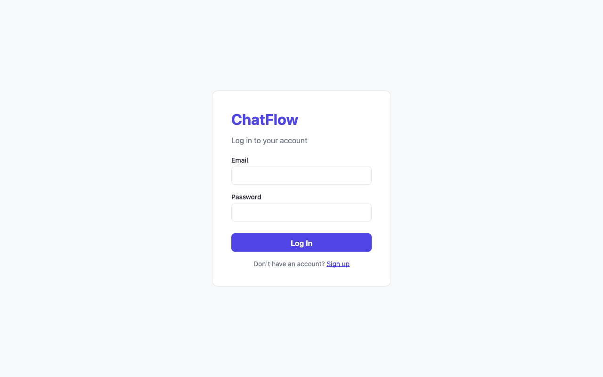
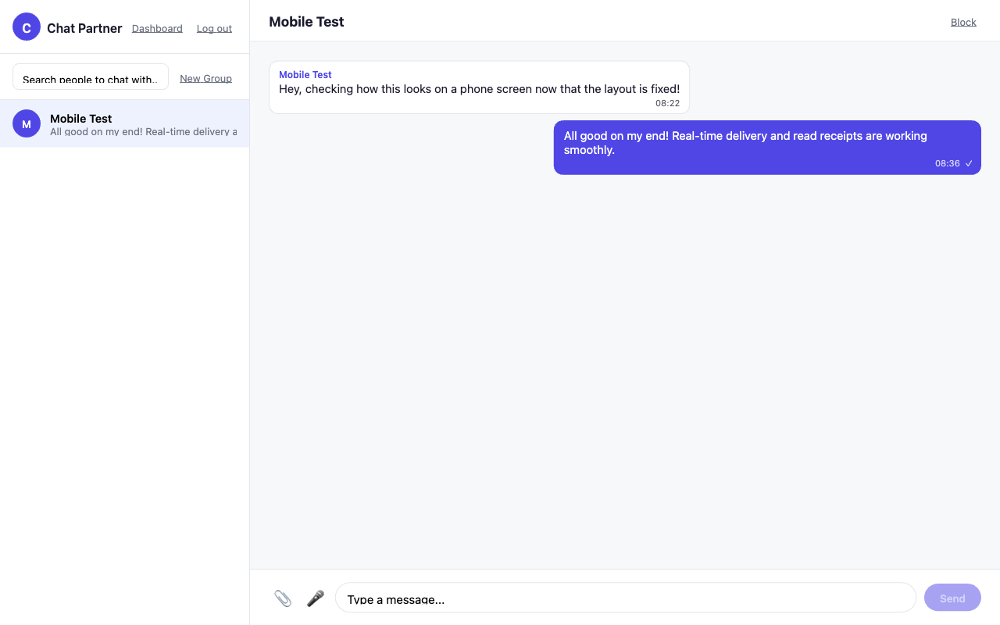
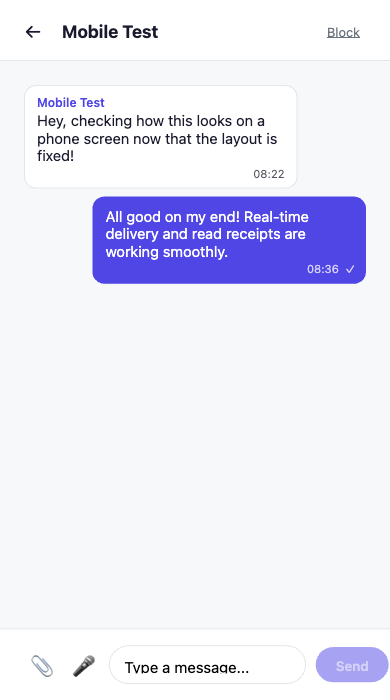
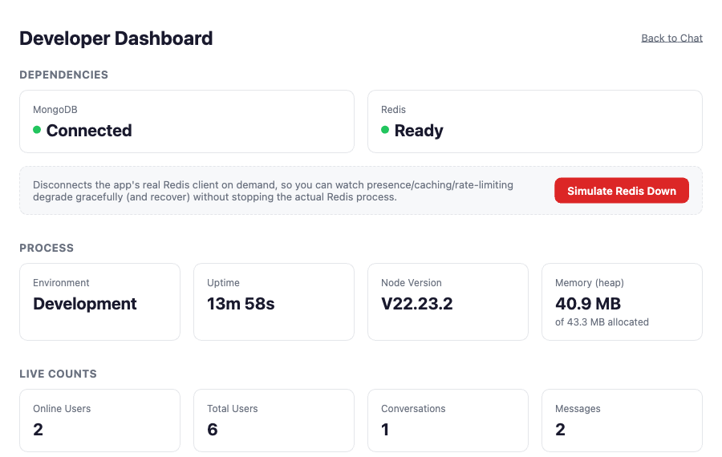

# ChatFlow

A real-time chat application (private chat, group chat, presence, read receipts,
file/voice messages) built to demonstrate industry-standard backend practices.

> This README grows with the project. Each phase adds its section (API docs,
> Socket.IO architecture, Redis architecture, Docker setup, etc.) as it's built.

**Live demo:** https://chatflow-one.vercel.app
*(free-tier backend - first request after ~15 min idle can take 30-60s to wake up)*

## Screenshots

| Login | Real-time chat |
|---|---|
|  |  |

| Mobile chat | Developer dashboard |
|---|---|
|  |  |

## Tech Stack

- **Backend:** Node.js, Express, MongoDB + Mongoose, Socket.IO, Redis, JWT, Zod, Multer
- **Frontend:** React, Vite, Socket.IO Client (added in Phase 21)
- **Testing:** Jest, Supertest
- **Docs:** Swagger / OpenAPI (added in Phase 20)
- **Deployment:** Docker, Docker Compose (added in Phase 24)

## Project Structure

```
ChatFlow/
  backend/
    src/
      config/       # env, logger, DB/Redis connections
      controllers/   # HTTP request/response handling
      middlewares/   # auth, error handling, validation, rate limiting
      models/         # Mongoose schemas
      routes/         # URL -> controller mappings
      services/       # business logic
      sockets/        # Socket.IO event handlers
      utils/          # reusable helpers
      validators/     # Zod schemas
      jobs/           # background/scheduled tasks
      app.js          # Express app (no listening)
      server.js       # entry point (listens, wires Socket.IO)
    tests/
  frontend/            # added in Phase 21
```

## Status

Complete. All 26 phases built and verified - see [ACCEPTANCE.md](./ACCEPTANCE.md)
for the full evidence record, or just run `./scripts/smoke-test.sh` to
reproduce every check yourself: backend tests, frontend build, both Docker
topologies (dev and TLS-terminated production mode), all in one script.

## Running with Docker (recommended)

Requires [Docker Desktop](https://www.docker.com/products/docker-desktop/)
running. This starts MongoDB, Redis, the backend API, and the frontend
together, wired to each other automatically.

```bash
cp .env.example .env   # then fill in JWT_SECRET / REFRESH_TOKEN_SECRET -
                        # generate each with:
                        # node -e "console.log(require('crypto').randomBytes(48).toString('hex'))"
docker compose up --build
```

- App: http://localhost:5173
- API: http://localhost:5001 (`/api/health`, `/api-docs` for Swagger)

Data persists across restarts (named volumes for Mongo/Redis/uploads).
`docker compose down` stops everything; add `-v` to also wipe the volumes.

> Runs with `NODE_ENV=development` semantics even inside containers - the
> refresh-token cookie's `secure` flag requires real HTTPS, which this local
> Compose stack doesn't terminate. See "Running in Production Mode" below
> for the topology that actually exercises that.

## Running in Production Mode (TLS-terminated)

Layers an nginx reverse proxy in front of the same stack, terminating HTTPS
so `NODE_ENV=production` can actually run correctly - the refresh-token
cookie's `secure` flag only gets sent by the browser over real TLS.

```bash
./proxy/generate-cert.sh   # one-time: self-signed cert for local testing
                            # (browsers will warn about it - that's correct
                            # behavior for a cert nothing has vouched for)
docker compose -f docker-compose.yml -f docker-compose.prod.yml up --build
```

- App: https://localhost (plain http:// redirects to https://)
- Backend and frontend are no longer directly published - only the proxy is,
  same as a real deployment where bypassing it would mean bypassing TLS.

## Running Locally, Without Docker

**Backend** (needs MongoDB + Redis running locally):

```bash
cd backend
npm install
cp .env.example .env   # fill in JWT_SECRET / REFRESH_TOKEN_SECRET
npm run dev
```

Then check: `GET http://localhost:5001/api/health`

> **Note (macOS):** Port 5000 is used by macOS's AirPlay Receiver by default,
> which is why this project defaults to 5001 instead.

**Frontend:**

```bash
cd frontend
npm install
cp .env.example .env   # VITE_API_URL, defaults to http://localhost:5001
npm run dev
```

Then open: http://localhost:5173

## Testing (Backend)

```bash
cd backend
npm test
```
